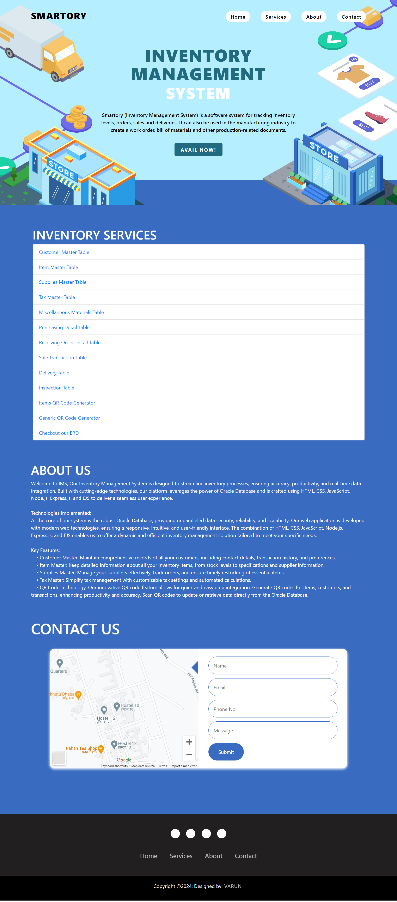

# Smartory-IMS

Smartory (Inventory Management System) is a software system for tracking inventory levels, orders, sales, and deliveries. It is designed to streamline inventory processes, ensuring accuracy, productivity, and real-time data integration.




## Technologies Used
- Oracle Database
- Node.js
- HTML
- CSS
- EJS (Embedded JavaScript Templating)

## Project Structure
This project consists of multiple servers, each handling different aspects of the inventory management system. Here are the details of each server:

1. **Customer Master** (Port: 3001)
    - Table: `CUSTOMER_MASTER`
    - EJS Files: `customer_table.ejs`, `customer_edit.ejs`
    - JS File: `server.js`

2. **Item Master** (Port: 3002)
    - Table: `ITEM_MASTER`
    - EJS Files: `item_table.ejs`, `item_edit.ejs`
    - JS File: `server2.js`

3. **Supplies Master** (Port: 3003)
    - Table: `SUPPLIES_MASTER`
    - EJS Files: `supplies_table.ejs`, `supplies_edit.ejs`
    - JS File: `server3.js`

4. **Tax Master** (Port: 3004)
    - Table: `TAX_MASTER`
    - EJS Files: `tax_table.ejs`, `tax_edit.ejs`
    - JS File: `server4.js`

5. **Misc Material Transactions** (Port: 3005)
    - Table: `MISC_MATERIAL_TRANSACTIONS`
    - EJS Files: `misc_table.ejs`, `misc_edit.ejs`
    - JS File: `server5.js`

6. **Purchasing Detail** (Port: 3006)
    - Table: `PURCHASING_DETAIL`
    - EJS Files: `purchasing_table.ejs`, `purchasing_edit.ejs`
    - JS File: `server6.js`

7. **Receiving Order Data** (Port: 3007)
    - Table: `RECEIVING_ORDER_DATA`
    - EJS Files: `receiving_table.ejs`, `receiving_edit.ejs`
    - JS File: `server7.js`

8. **Sale Transaction** (Port: 3008)
    - Table: `SALE_TRANSACTION`
    - EJS Files: `sale_table.ejs`, `sale_edit.ejs`
    - JS File: `server8.js`

9. **Delivery** (Port: 3009)
    - Table: `DELIVERY`
    - EJS Files: `delivery_table.ejs`, `delivery_edit.ejs`
    - JS File: `server9.js`

10. **Inspection** (Port: 3010)
    - Table: `INSPECTION`
    - EJS Files: `inspection_table.ejs`, `inspection_edit.ejs`
    - JS File: `server10.js`

11. **Item QR Code** (Port: 3011)
    - Table: `*ACTION_ON_ITEM_MASTER`
    - HTML File: `qr.html`
    - JS File: `qr.js`

12. **Generic QR Code** (Port: 3012)
    - Table: `*NONE`
    - HTML File: `qr_2.html`
    - JS File: `qr_2.js`

## Getting Started

### Prerequisites
- Node.js
- Oracle Database with Instant Client

### Installation
1. Clone the repository:
    ```bash
    git clone https://github.com/ivarungupta/Smartory-IMS.git
    cd Smartory-IMS
    ```

2. Install dependencies:
    ```bash
    npm install
    ```

3. Set up the Oracle Client Library:
    ```javascript
    oracledb.initOracleClient({ libDir: 'C:\\oraclexe\\instantclient_11_2' });
    ```

### Running the Servers
Open a new terminal for each server and run the following commands:

```bash
# Customer Master
node server.js

# Item Master
node server2.js

# Supplies Master
node server3.js

# Tax Master
node server4.js

# Misc Material Transactions
node server5.js

# Purchasing Detail
node server6.js

# Receiving Order Data
node server7.js

# Sale Transaction
node server8.js

# Delivery
node server9.js

# Inspection
node server10.js

# Item QR Code
node qr.js

# Generic QR Code
node qr_2.js
